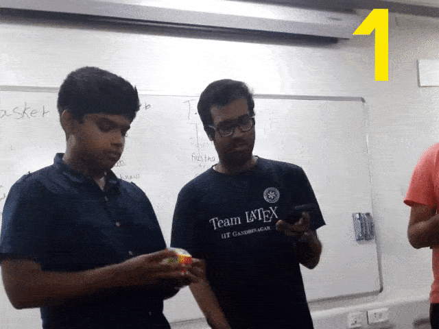
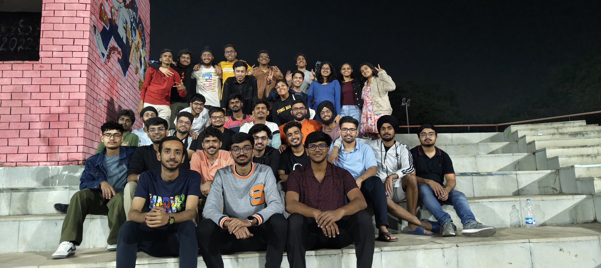
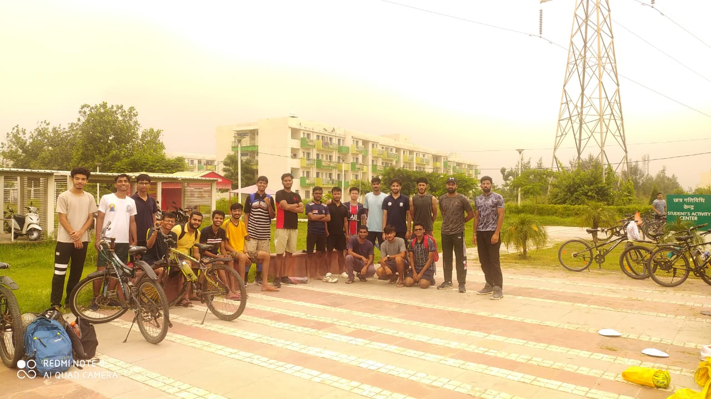
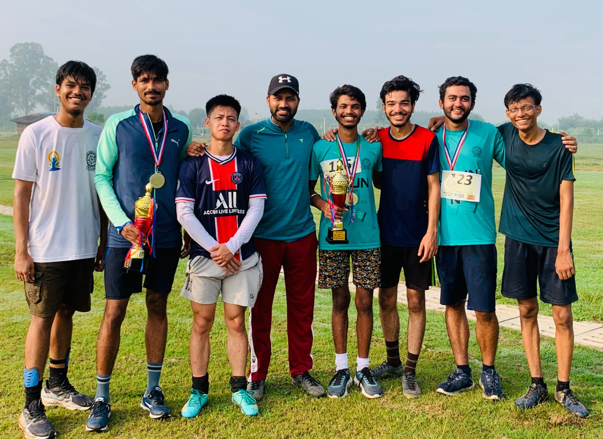
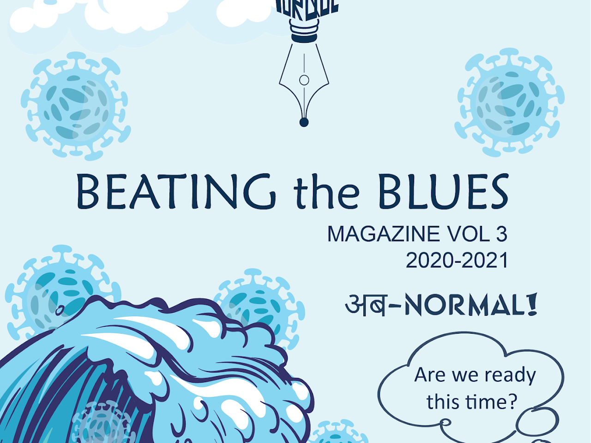
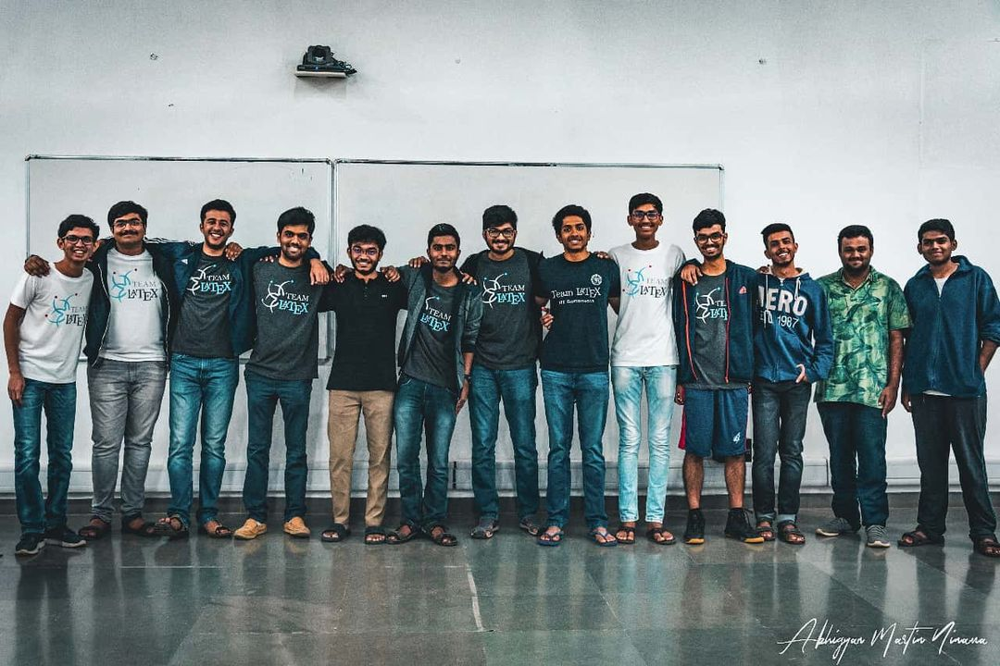

<!-- ## Rubik's Cube

My journey with the Rubik's cube started way back in class 5 when I was fascinated with the puzzle. Slowly I started getting better at solving it, when in class 10, I was able to solve in just around 13 seconds! I slowly adapted myself to solving a variety of different twisty puzzles, and can today solve more than 15 kinds of twisties! -->

## InterIIT Tech Meet 2024

- Part of InterIIT Tech contingent, IIT Ropar.  

## Sports - Soccer

<!-- {% include carousel.html height="50" unit="%" duration="7" number="2" %} -->

- Part of IIT Ropar Soccer team.

- Made my entry into IIT Ropar's Soccer team in my first year, where I played Fullback. I represented my year in the Inter Year Sports Championship where we secured bronze in Soccer and won the overall championship.

## 11Km Marathon
{% include carousel.html height="50" unit="%" duration="7" number="2" %}

<!--  -->

- Completed an 11km marathon in my second year at IIT Ropar. It was a great experience, and I was able to complete the marathon in 1 hour and 6 minutes.

- I also participated in the 11km marathon in my third and fourth year, and was able to complete it in 58 minutes and 57 minutes respectively.

<!-- ## Instruments

<iframe width="420" height="315" src="http://www.youtube.com/embed/hccr3vX6kyw" frameborder="0" allowfullscreen></iframe>

I play the keyboard when I want to feel at peace :) This is a cover of Fur Elise that I did a while back. -->

<!-- ## Torque

Torque is the annual campus magazine of IITGN. I joined the Torque 3.0 team as the Chief Editor of the Editorial Board. It took a lot of effort to write, collaborate, and go from releasing the online version of the magazine to actually printing it amidst a pandemic! -->

## Leadership Summit IIT Ropar

{% include carousel.html height="50" unit="%" duration="7" number="1" %}

Leadership summit - Annual Leadership Summit of IITRPR

- I was part of the organizing team (Tech lead) for the Leadership Summit 2022. The event was a huge success, we had representatives from all IITs, and the event was a huge success. We had a lot of fun, and I learned a lot about organizing events.

<!-- ## Team LaTeX

Team LaTeX was born with the spirit of inculcating a technical culture in the institute.  LaTeX is a popular typesetting tool used in most academic works, and we hosted a two day workshop to improve the understanding of LaTeX amongst the students of IITGN. In my first year, I was a organizer, and in my second year, managed the entire event.
 -->

<!-- ## Writing

I occasionally like to write on my experiences and things that I did uniquely. Checkout some of my articles below.

- GRE: My Test Centre Experience | by Arnav Kharbanda | Medium 

- Cracking the MITACS Globalink Research Internship (GRI) | by Arnav Kharbanda | Medium  - Record number of people cracked MITACS from IITGN after the article. Correlation -> Causation? I hope so :)

- Invent@IITGN 2019 Experience - Praveen | Academic Council | IIT Gandhinagar 

- Pandemic? What pandemic? We’re Innovators! - Torque 

An old blog website that I had. A peek into 2nd year Praveen XD - Random Thoughts – A peek into my mind (wordpress.com) 

More on my experiences on applying to grad school, and how I dominated GRE and TOEFL. Stay tuned... -->

## Teaching and Mentoring

- Resettlement training of Army Professionals: Part of an initiative to train over 40 retired government officers in a program aimed at equipping retired army professionals for civilian jobs, focusing on understanding and building drone components.

- Atal Tinkering Labs Mentor: Taught 50+ teachers from Punjab on robotics and lab equipment, conducted 9 hands-on sessions, and collaborated with the Deputy Commissioner of Rupnagar to promote STEM education in under-resourced schools.

- Snehita Wellbeing Cell, IIT Ropar: Served as a Snehita Buddy at 'Snehita Wellbeing Cell,' actively promoting mental health initiatives among students campus-wide.